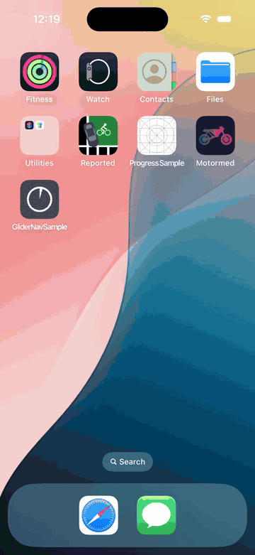
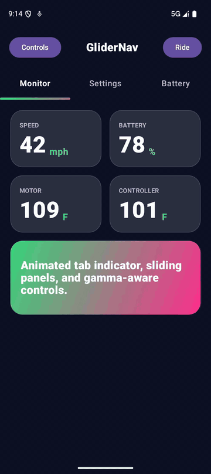

# GliderNav

## Demo

| iOS | Android |
| --- | --- |
|  |  |

Reusable Android and SwiftUI navigation primitives extracted from Motormed.

The Android package/namespace is `one.adverse.glider`. The Swift package module is `GliderNav`.

## Repository Layout

```text
android/library  Android library module
android/sample   Android sample app
ios/library      Swift package sources and tests
ios/sample       SwiftUI sample app source
```

## What It Includes

- `GliderScaffold`: three-column slider shell with left panel, center content, and right panel.
- `GliderPager`: top tab row plus swipeable page content.
- `GliderTabIndicator`: animated gradient tab indicator.
- `GliderSlider` / `GliderGradientSlider`: gamma-aware gradient slider used for non-linear ranges.

## Samples

Android sample app:

```bash
./gradlew :android:sample:installDebug
```

iOS sample app source lives at:

```text
ios/sample/GliderNavSample
```

Generate and open the iOS sample project:

```bash
xcodegen generate --spec ios/sample/GliderNavSample/project.yml
open ios/sample/GliderNavSample/GliderNavSample.xcodeproj
```

## Android

Add JitPack in your app's `settings.gradle.kts`:

```kotlin
dependencyResolutionManagement {
    repositoriesMode.set(RepositoriesMode.FAIL_ON_PROJECT_REPOS)
    repositories {
        google()
        mavenCentral()
        maven { url = uri("https://jitpack.io") }
    }
}
```

Then add the dependency:

```kotlin
dependencies {
    implementation("com.github.snooplsm.glider-nav:glider-nav:v0.1.3")
}
```

```kotlin
import one.adverse.glider.GliderPager
import one.adverse.glider.GliderScaffold
import one.adverse.glider.GliderTab
import one.adverse.glider.rememberGliderScaffoldState

val scaffoldState = rememberGliderScaffoldState()

GliderScaffold(
    state = scaffoldState,
    leftPanel = { SettingsPanel() },
    rightPanel = { RidePanel() },
) { glider ->
    GliderPager(
        tabs = listOf(
            GliderTab("monitor", "Monitor"),
            GliderTab("settings", "Settings"),
            GliderTab("battery", "Battery"),
        ),
        selectedIndex = selectedIndex,
        onSelectedIndexChange = { selectedIndex = it },
    ) { page ->
        when (page) {
            0 -> MonitorScreen()
            1 -> SettingsScreen()
            2 -> BatteryScreen()
        }
    }
}
```

Let Android's system back gesture take priority at the screen edges:

```kotlin
GliderScaffold(
    state = scaffoldState,
    systemBackGestureExclusionEnabled = false,
    leftPanel = { SettingsPanel() },
    rightPanel = { RidePanel() },
) { glider ->
    AppContent()
}
```

Build locally:

```bash
./gradlew :android:library:assembleDebug
./gradlew :android:sample:assembleDebug
```

Publish to Maven local:

```bash
./gradlew :android:library:publishToMavenLocal
```

Create a release for JitPack:

```bash
git tag v0.1.3
git push origin v0.1.3
```

Coordinate:

```kotlin
implementation("com.github.snooplsm.glider-nav:glider-nav:v0.1.3")
```

## SwiftUI

Add the Swift package in Xcode:

```text
https://github.com/snooplsm/glider-nav
```

Choose version `0.1.2` or newer, then import the module:

```swift
import GliderNav
```

Or add it to `Package.swift`:

```swift
dependencies: [
    .package(url: "https://github.com/snooplsm/glider-nav.git", from: "0.1.2")
],
targets: [
    .target(
        name: "YourApp",
        dependencies: [
            .product(name: "GliderNav", package: "glider-nav")
        ]
    )
]
```

```swift
import GliderNav

@StateObject private var glider = GliderScaffoldState()
@State private var selectedTab = 0

GliderScaffold(
    state: glider,
    leftPanel: { SettingsPanel() },
    center: { state in
        GliderPager(
            tabs: [
                GliderTab(id: "monitor", title: "Monitor", systemImage: "waveform.path.ecg"),
                GliderTab(id: "settings", title: "Settings", systemImage: "slider.horizontal.3"),
                GliderTab(id: "battery", title: "Battery", systemImage: "battery.100")
            ],
            selection: $selectedTab
        ) { page in
            switch page {
            case 0: MonitorScreen()
            case 1: SettingsScreen()
            default: BatteryScreen()
            }
        }
    },
    rightPanel: { RidePanel() }
)
```

Validate the Swift package:

```bash
swift test
```
